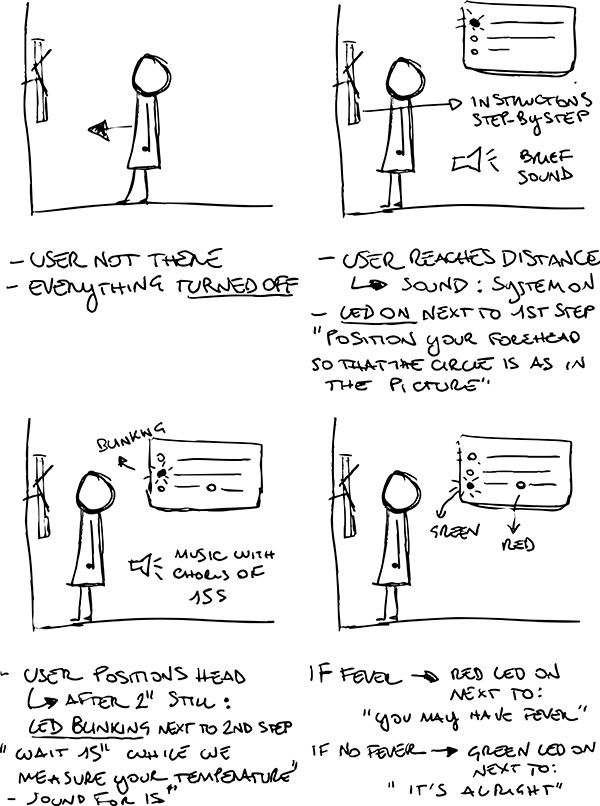

# Hardware temperature detection project

Project to build a simple, cheap, open source fever detection device. The aim is to allow symptomatic people to be quickly isolated.

On slack channel [#hardware-temperature-detection](https://app.slack.com/client/TUTSYURT3/CVCEV2V0V/thread/CV96HC6DN-1584885987.479600) from [helpfulengineering.slack.com](https://helpfulengineering.slack.com/)

Fast fever detection followed by isolation reduces the spread of infectious diseases.

## User Experience

Journey a user goes through to use the system
Initial idea is represented in the picture, taking the user from the first interface with the device to the result feedback. 
It assumes the mirror alignment but does not go into detail about it yet. 
It also lacks the user experience after the outcome communication. 

## Functional diagram

## [Project wiki](https://github.com/helpfulengineering/project-temperature-detection/wiki)

